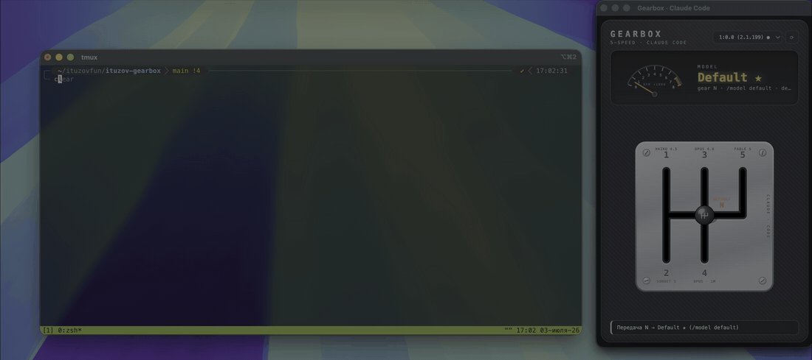

# 🏎️ ituzov-gearbox

**Коробка передач для Claude Code.** Дёргаешь рычаг, модель переключается. Всё.

<p align="center">
  <a href="https://ituzovlab.ru"><b>🔗 ITUZOV LAB</b></a> · сообщество разработчиков: понимаем AI, растём как инженеры
</p>

Маленький опенсорс-гаджет: на экране висит 5-ступенчатая кулиса, как в машине. Тянешь ручку в паз, она клацает, тахометр подрывается, и в твою сессию [Claude Code](https://claude.com/claude-code) сама печатается команда `/model opus` (ну или какую передачу воткнул).

> Без Electron, без единой зависимости. ~600 строк ванильного JS, читается за вечер с чаем.



## Как это работает

```
[ окно с коробкой ]  →  локальный сервер (127.0.0.1)  →  tmux send-keys  →  [ Claude Code ]
```

Фокус простой. Claude Code крутится внутри [tmux](https://github.com/tmux/tmux), а tmux умеет печатать в панель снаружи, командой `tmux send-keys`. Вот и вся магия: коробка это просто красивая веб-морда над одной командой. Открой [`src/tmux.js`](src/tmux.js) и убедись сам, это единственный файл, который вообще трогает твой терминал.

Бонус: при старте коробка сама узнаёт, какие модели есть у тебя на самом деле. Открывает пикер `/model` в панели, читает экран через `tmux capture-pane`, парсит список и закрывает пикер Escape'ом. Так что передачи всегда совпадают с твоим реальным Claude Code. Если панель занята (Claude что-то генерит), коробка туда не лезет. А если положил свой `gearbox.config.json`, автодетект его не тронет.

**Чего тут нет:** запросов в интернет, телеметрии, доступа к твоим ключам и файлам. Сервер слушает только `127.0.0.1`, наружу ничего не торчит.

## Установка

Понадобится Node.js 18+, tmux и желательно какой-нибудь Chromium (для окошка-гаджета).

```bash
# 1. запускаем Claude Code внутри tmux
brew install tmux        # если ещё нет
tmux
claude

# 2. в другом терминале запускаем коробку
npx ituzov-gearbox
```

Из склонированного репозитория запускается так:

```bash
git clone https://github.com/ituzov/ituzov-gearbox.git
cd ituzov-gearbox
npm start
```

В правом верхнем углу появится окошко. Панель с Claude Code найдётся сама (в селекторе она помечена ●). Дальше руками.

### Автошкола

- **Тяни ручку** по прорезям. Она ходит как настоящий рычаг: по диагонали через металл не проедешь, только через нейтраль.
- **Отпустил в пазу?** Передача воткнулась: клац, перегазовка, `/model` улетел в терминал.
- **Отпустил на полпути?** Рычаг отпружинит обратно. Не попал в синхрон, бывает.
- **Лень тянуть?** Кликни по цифре, ручка доедет сама.

## Карта передач

Откуда берутся передачи, по приоритету:

1. **Твой `gearbox.config.json`** — если положил, коробка слушается только его.
2. **Живой пикер `/model`** — обычный режим: коробка сама читает список моделей из твоей панели и раскладывает их по передачам. Ничего настраивать не надо.
3. **Зашитый дефолт** — запасной вариант, если панель занята или прочитать пикер не вышло.

Порядок передач как тяга в машине: первая для самой лёгкой модели, высшая для топовой. Нейтраль возвращает на дефолтную модель.

```
 1   3   5        1 · Haiku 4.5    3 · Opus 4.8    5 · Fable 5
 │   │   │
 ├───N───┤        2 · Sonnet 5     4 · Opus 4.8 · 1M   N · Default
 │   │
 2   4
```

Свой конфиг нужен, только если хочешь нестандартную раскладку: например, любимую модель на первую передачу. Клади `gearbox.config.json` рядом с местом запуска (пример лежит в [`gearbox.config.example.json`](gearbox.config.example.json)):

```json
{
  "gears": [
    { "pos": "1", "col": 0, "row": 0, "model": "haiku", "name": "Haiku 4.5", "desc": "fastest" }
  ]
}
```

Тут `model` это то, что печатается после `/model `, а `col` и `row` задают место паза на кулисе: колонки 0–2 (у нейтрали `col: null`, середина рейки), ряды 0–2, где 1 это нейтральная рейка.

## CLI

```bash
npx ituzov-gearbox                     # порт по умолчанию 4321
npx ituzov-gearbox 5555                # свой порт
GEARBOX_NO_OPEN=1 npx ituzov-gearbox   # только сервер, без окна
```

## Инструкция для агента

Если ты AI-агент (Claude Code, Cursor, да кто угодно) и человек попросил «поставь мне эту коробку», вот твой чеклист:

```
1. Проверь зависимости:
   node --version   # нужен 18+
   tmux -V          # нет? поставь: brew install tmux (mac) / apt install tmux (linux)

2. Убедись, что Claude Code запущен ВНУТРИ tmux:
   tmux list-panes -a -F '#{pane_id} #{pane_current_command} #{pane_title}'
   # ищи панель с claude в command или title
   # если её нет: попроси человека запустить `tmux`, а внутри `claude`
   # (сам не запускай: сессия должна остаться у человека)

3. Запусти коробку из клона репозитория:
   npm start        # или: node bin/cli.js
   # окно откроется само; проверка сервера: curl http://127.0.0.1:4321/api/panes

4. Проверь, что всё поехало:
   curl -s http://127.0.0.1:4321/api/config    # карта передач
   # в окне статус должен показать «Передачи считаны с пикера»

Отладка: сервер пишет в stdout; все эндпоинты в src/server.js;
терминал трогает только src/tmux.js (send-keys, capture-pane).
Не редактируй ничего без запроса человека.
```

## Что где лежит

```
bin/cli.js      точка входа: поднимает сервер, открывает окно
src/server.js   HTTP-сервер без зависимостей, 4 эндпоинта (config / panes / models / shift)
src/tmux.js     единственный файл с доступом к терминалу
src/config.js   дефолтная карта передач + чтение gearbox.config.json
public/         сама коробка: ванильные HTML/CSS/JS, SVG, WebAudio
```

## Зачем это всё

Рычаг КПП для переключения моделей придумал не я, идея гуляла по сети. Но существующая аппка закрытая и платная. Ставить неизвестный бинарник между своими руками и терминалом? Ну такое. Поэтому вот вам та же радость в опенсорсе: сначала читаешь код, потом доверяешь.

## Автор

Илья Тузов, [**ITUZOV LAB**](https://ituzovlab.ru) и канал [@ituzov_fun](https://t.me/ituzov_fun).

Понравилась коробка и хочется не просто тыкать в AI-инструменты, а понимать, как они устроены? Заходи в [**ITUZOV LAB**](https://ituzovlab.ru): сообщество разработчиков, где учатся создавать сложные системы и расти как инженеры. Глубже кода, дальше алгоритмов.

## Лицензия

[MIT](LICENSE) © [Илья Тузов](https://ituzovlab.ru)
